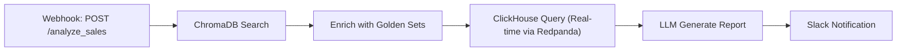

# 🤖 AI INTEGRATION GUIDE — Vanna AI + Flowise + ChromaDB Brain

## Objetivo

Integrar la memoria indexada (ChromaDB) del Agente Residente en Vanna AI y Flowise para:
- **Few-shot prompting**: Buscar ejemplos similares antes de generar SQL
- **Semantic validation**: Comparar resultados vs golden sets
- **Context enrichment**: Inyectar lineage + field descriptions

---

## 1. VANNA AI + ChromaDB

### Arquitectura

```
User Question (natural language)
    ↓
Vanna AI Engine
    ├─ Search ChromaDB: "queries similares"
    ├─ Fetch golden sets
    ├─ Generate SQL (few-shot prompt)
    └─ Execute via Cube SQL API (15432)
    ↑
    └─ Validate result schema vs CONTEXT.md
```

### Implementación (vanna-ai/main.py)

```python
#!/usr/bin/env python3
"""
Vanna AI con ChromaDB integration (v0.8)
"""

from fastapi import FastAPI, WebSocket
from langchain_community.vectorstores import Chroma
from langchain_openai import ChatOpenAI, OpenAIEmbeddings
from vanna.remote import RemoteVanna
import os
import json

app = FastAPI()

# ChromaDB client (conectar a .agent/vectordb/)
chroma_client = Chroma(
    collection_name="aura_config_knowledge",
    persist_directory="/app/.agent/vectordb",
    embedding_function=OpenAIEmbeddings(model="text-embedding-3-small")
)

# Vanna AI setup
vanna = RemoteVanna(
    api_key=os.getenv("VANNA_API_KEY"),
    model="claude-3-sonnet"  # o gpt-4
)

def enrich_prompt_with_golden_sets(user_question: str) -> str:
    """
    Buscar ejemplos similares en ChromaDB y enrichir el prompt.
    """
    # Query ChromaDB
    results = chroma_client.similarity_search(
        query=user_question,
        k=3  # Top 3 ejemplos similares
    )
    
    golden_sets = "\n".join([
        f"- {result.metadata['source']}: {result.page_content[:200]}"
        for result in results
    ])
    
    enriched_prompt = f"""
    Contexto (ejemplos similares):
    {golden_sets}
    
    Usuario pregunta: {user_question}
    
    Generar SQL sobre Cube SQL API:
    - host: cube:15432
    - database: aura_gold
    - user: superset
    
    Tablas disponibles:
    - fct_sales (order_id, customer_id, product_id, amount, created_at)
    - dim_customer (customer_id, name, segment, lifetime_value)
    - dim_product (product_id, sku, category, price)
    """
    
    return enriched_prompt

@app.websocket("/ws/chat")
async def websocket_endpoint(websocket: WebSocket):
    """Chat endpoint con RAG behavior"""
    await websocket.accept()
    
    while True:
        # Recibir pregunta del usuario
        data = await websocket.receive_text()
        user_question = json.loads(data).get("question")
        
        # Enriquecer prompt con golden sets
        enriched_prompt = enrich_prompt_with_golden_sets(user_question)
        
        # Generar SQL con Vanna AI
        try:
            sql_query = vanna.generate_sql(enriched_prompt)
            
            # Validar schema vs CONTEXT.md (TODO)
            # validate_sql_schema(sql_query)  
            
            # Ejecutar vs Cube SQL API
            import psycopg2
            conn = psycopg2.connect(
                host="cube",
                port=15432,
                database="aura_gold",
                user="superset",
                password=os.getenv("CUBE_SQL_PASSWORD")
            )
            cursor = conn.cursor()
            cursor.execute(sql_query)
            results = cursor.fetchall()
            
            # Retornar con linaje
            response = {
                "status": "success",
                "sql": sql_query,
                "results": results,
                "lineage": {
                    "tables": ["fct_sales", "dim_customer"],
                    "source": "Cube Semantic Layer"
                }
            }
        except Exception as e:
            response = {
                "status": "error",
                "message": str(e),
                "hint": "Revisa logs en .agent/logs/vanna.log"
            }
        
        await websocket.send_text(json.dumps(response))

if __name__ == "__main__":
    import uvicorn
    uvicorn.run(app, host="0.0.0.0", port=8011)
```

### Uso desde UI (Vanna Chat)

```
Usuario: "¿Cuál fue mi venta más grande en marzo?"

Agente Vanna:
1. Busca en ChromaDB: "venta más grande + fecha"
2. Encuentra golden set: "SELECT * FROM fct_sales WHERE DATE_TRUNC('month', created_at) = '2026-03' ORDER BY amount DESC LIMIT 1"
3. Genera SQL similar (few-shot)
4. Ejecuta vs Cube SQL API (conectado a ClickHouse aura_gold)
5. Retorna resultado + lineage (Postgres -> Debezium -> Redpanda -> ClickHouse)
```

---

## 2. FLOWISE + ChromaDB

### Nodos Disponibles

**Node 1: ClickHouse Data Loader**
```javascript
{
  "nodeType": "ClickHouseDataLoader",
  "parameters": {
    "host": "clickhouse-server",
    "port": 8123,
    "query": "SELECT * FROM aura_gold.fct_sales WHERE customer_id = {{customer_id}}"
  }
}
```

**Node 2: ChromaDB Vector Search**
```javascript
{
  "nodeType": "ChromaDBSearch",
  "parameters": {
    "collectionName": "aura_config_knowledge",
    "vectorDbPath": "/app/.agent/vectordb",
    "query": "{{user_message}}",
    "topK": 3
  }
}
```

**Node 3: LLM Prompt Chain**
```javascript
{
  "nodeType": "LLMChain",
  "parameters": {
    "model": "gpt-4",
    "systemPrompt": "Eres analista BI experto en {{context_from_chromadb}}",
    "userMessage": "{{user_input}}"
  }
}
```

**Node 4: Slack Notification**
```javascript
{
  "nodeType": "SlackNotify",
  "parameters": {
    "channel": "#analytics",
    "message": "Análisis completado: {{llm_output}}"
  }
}
```

### Workflow Example: Sales Analysis Report



**JSON Config:**
```json
{
  "workflow": {
    "id": "sales_analysis_report",
    "name": "Weekly Sales Analysis",
    "trigger": "webhook",
    "nodes": [
      {
        "id": "webhook",
        "type": "WebhookTrigger",
        "config": {
          "path": "/analyze_sales",
          "method": "POST"
        }
      },
      {
        "id": "chromadb_search",
        "type": "ChromaDBSearch",
        "config": {
          "query": "{{payload.question}}",
          "topK": 3
        }
      },
      {
        "id": "clickhouse_query",
        "type": "ClickHouseDataLoader",
        "config": {
          "query": "SELECT * FROM aura_gold.fct_sales WHERE DATE_TRUNC('week', created_at) = CURRENT_WEEK ORDER BY amount DESC LIMIT 10"
        }
      },
      {
        "id": "llm_analysis",
        "type": "LLMChain",
        "config": {
          "systemPrompt": "Generar reporte ejecutivo de ventas basado en: {{chromadb_search.results}} y datos: {{clickhouse_query.results}}",
          "model": "gpt-4"
        }
      },
      {
        "id": "slack_notify",
        "type": "SlackNotify",
        "config": {
          "channel": "#analytics",
          "message": "📊 Reporte de Ventas (Semana {{current_week}}):\n\n{{llm_analysis.output}}"
        }
      }
    ]
  }
}
```

### UI Configuration (Flowise Dashboard)

1. Go to: http://localhost:3001
2. New Workflow → "Sales Analysis Report"
3. Drag nodes:
   - Webhook → ChromaDB Search → ClickHouse → LLM → Slack
4. Configure cada nodo con valores de .env
5. Click "Deploy"

---

## 3. CONTEXT PROPAGATION

### De CONTEXT.md a Vanna/Flowise

El agente automáticamente inyecta contexto:

```python
# brain_index.py integration point
class AuraContextPropagation:
    def __init__(self):
        self.context_doc = read_file(".agent/CONTEXT.md")
        self.rules = read_file(".agent/RULES.md")
    
    def inject_into_vanna(self):
        """Pasar schemas y campos críticos a Vanna AI"""
        vanna_context = {
            "tables": {
                "fct_sales": {
                    "fields": parse_table_fields(self.context_doc, "fct_sales"),
                    "validations": parse_validations(self.context_doc, "fct_sales")
                },
                "dim_customer": { ... },
                "dim_product": { ... }
            },
            "rules": {
                "latency_sla": "< 1s",
                "accuracy_requirement": "99%",
                "oidc_required": True
            }
        }
        return vanna_context
    
    def inject_into_flowise(self):
        """Pasar a Flowise como variables globales"""
        flowise_vars = {
            "VALID_CURRENCIES": ["MXN", "USD", "EUR"],
            "VALID_SEGMENTS": ["premium", "standard", "vip"],
            "CUSTOMER_ID_MIN": 1,
            "CUSTOMER_ID_MAX": 1000000,
            "AMOUNT_MIN": 0,
            "AMOUNT_MAX": 999999.99
        }
        return flowise_vars
```

---

## 4. VALIDACIÓN DE RESULTADOS

### Schema Validation (Post-query)

```python
def validate_vanna_result(query_result):
    """Validar resultado vs CONTEXT.md"""
    
    expected_schema = get_schema_from_context("fct_sales")
    actual_schema = get_schema(query_result)
    
    if not schema_match(expected_schema, actual_schema):
        raise SchemaValidationError(
            f"Result schema mismatch: expected {expected_schema}, got {actual_schema}"
        )
    
    # Validar valores
    for row in query_result:
        if row['amount'] < 0 or row['amount'] > 999999.99:
            raise ValueValidationError(f"Amount out of range: {row['amount']}")
        
        if row['currency'] not in ["MXN", "USD", "EUR"]:
            raise ValueValidationError(f"Invalid currency: {row['currency']}")
    
    return True
```

---

## 5. AUDITORÍA Y LOGGING

Todos los queries de Vanna/Flowise se registran:

```sql
-- tabla: aura_silver.ai_audit_log
INSERT INTO aura_silver.ai_audit_log VALUES (
    'vanna_ai',                           -- tool
    'user@example.com',                   -- user
    'Venta más grande en marzo',          -- natural_language_question
    'SELECT * FROM fct_sales WHERE ...',  -- generated_sql
    5.2,                                  -- execution_time_seconds
    15,                                   -- result_row_count
    'success',                            -- status
    NOW()
);
```

---

## 6. INSTALACIÓN RÁPIDA

#### Vanna AI (ya en docker-compose.yml)

```bash
# Build imagen custom
docker build -t vanna-ai:latest ./vanna-ai

# Levantar servicio
docker-compose up -d vanna-ai

# Verificar en: http://localhost:8011
```

#### Flowise (ya en docker-compose.yml)

```bash
# Levantar servicio
docker-compose up -d flowise

# Acceder a: http://localhost:3001
# Crear primer workflow y deploying
```

---

## 7. TROUBLESHOOTING

### ❌ Vanna AI: "ChromaDB connection refused"
```bash
python .agent/brain_index.py --index  # Re-indexar
docker-compose restart vanna-ai
```

### ❌ Flowise: "Webhook timeout"
```bash
# Aumentar timeout en Flowise: Settings → Advanced → Timeout (30s)
# Verificar ClickHouse está activo: curl http://localhost:8123/?query=SELECT%201
```

### ❌ "Golden set not found"
```bash
# Asegurar golden_sets/ está poblado
ls -la .agent/golden_sets/
# Si está vacío, crear ejemplos manuales (JSON format)
```

---

## 📊 Métricas de AI Performance

| Métrica | Objetivo | Check |
|---------|----------|-------|
| Query generation latency | < 5s | Vanna AI logs |
| Schema accuracy | 99% | Validate query results |
| Golden set hit rate | ≥ 80% | ChromaDB similarity score |
| Flowise workflow success | ≥ 95% | Flowise dashboard |

---

**Versión:** 1.0 (2026-04-15)  
**Próxima revisión:** Cuando se agreguen nuevos workflows Flowise
