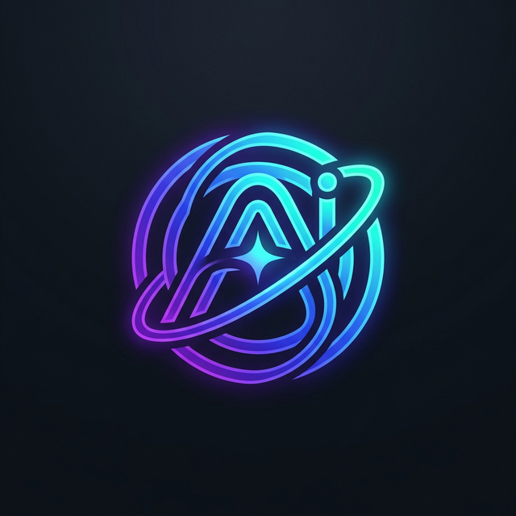
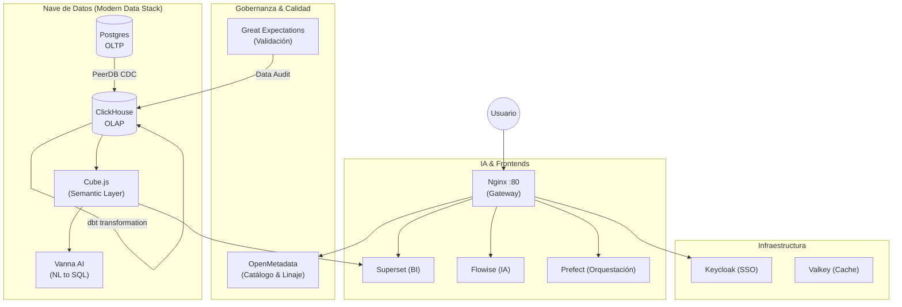

<p align="center">
  
</p>

# 🌌 Aura Intelligence Suite (v8.2) — Ecosistema Total de Datos

**Aura Intelligence Suite** es una Plataforma de Datos Moderna (Modern Data Stack) de nivel empresarial, diseñada bajo estándares de alta disponibilidad, gobernanza y calidad de datos. Integra el ciclo completo de vida del dato: Ingesta (CDC), Transformación (dbt), Calidad (Great Expectations), Semántica (Cube.js), BI/IA (Superset + GenAI) y Gobernanza (OpenMetadata).

> [!IMPORTANT]
> **Requisitos de Sistema (Arquitectura v8.2):**
> - **RAM**: 24 GB mínimo (se recomiendan 32 GB para el stack completo con Gobernanza).
> - **CPU**: 8 vCPUs.
> - **Almacenamiento**: 150 GB NVMe (SSD recomendado para ClickHouse).

---

## 🚀 PARTE 1: El Salto a la Plataforma Global (v8.2)

A diferencia de un stack de BI tradicional, la v8.2 de Aura implementa las tres capas críticas que utilizan empresas como Uber o Netflix para garantizar la confianza en los datos:

### 1. Transformación Estructurada (dbt)
No solo movemos datos; los refinamos. Usamos **dbt (data build tool)** para transformar los datos crudos (Bronze) en modelos limpios (Silver) y KPIs listos para negocio (Gold) directamente dentro de ClickHouse.
- **Versionado**: Todo el modelo de datos vive en Git.
- **Linaje**: Trazabilidad completa desde la tabla origen hasta la métrica final.

### 2. Calidad de Datos (Great Expectations)
La precisión es innegociable. Integramos **Great Expectations** en los pipelines de Prefect para validar los datos post-carga.
- **Validaciones automáticas**: Control de nulos, rangos de fechas lógicos y consistencia referencial.
- **Alertas**: Si un test falla, el pipeline se detiene y notifica vía webhook.

### 3. Gobernanza y Linaje (OpenMetadata)
Centralizamos la inteligencia del ecosistema. **OpenMetadata** actúa como el catálogo unificado donde los usuarios pueden buscar términos de negocio, ver quién es el dueño de un dataset y entender el camino visual del dato (Postgres -> PeerDB -> ClickHouse -> dbt -> Cube -> Superset).

---

## 🛠️ PARTE 2: Arquitectura Técnica

### 2.1 El Stack de 13 Capas

| Capa | Componente | Función |
| :--- | :--- | :--- |
| **Ingesta** | PeerDB (CDC) | Replicación real-time desde PostgreSQL mediante WAL lógico. |
| **Almacenamiento** | ClickHouse | Motor OLAP de alto rendimiento (Capas Bronze, Silver y Gold). |
| **Transformación** | dbt | Lógica de negocio estructurada en modelos SQL versionados. |
| **Calidad** | Great Expectations | Tests de validación automática integrados en orquestación. |
| **Caché** | Valkey | Reemplazo de alto rendimiento de Redis para metadatos y colas. |
| **Semántica** | Cube.js | Capa de definición de métricas unificada y SQL API. |
| **Visualización** | Apache Superset | Dashboarding avanzado y exploración de datos. |
| **IA Generativa** | Flowise + Vanna AI | Agentes RAG y asistentes Natural Language -> SQL. |
| **Gobernanza** | OpenMetadata | Catálogo de datos, Glosario de negocio y Linaje visual. |
| **Orquestación** | Prefect v3 | Control de pipelines ETL/ELT y disparadores de flujos dbt. |
| **Identidad** | Keycloak | Gestión unificada de accesos vía OIDC (SSO). |
| **Observabilidad** | Grafana + Prometheus | Monitoreo de salud, rendimiento y SLAs de datos. |
| **Gateway** | Nginx | Puerta de entrada segura y única (Puerto 80). |

### 2.2 Diagrama de Arquitectura Moderna


```mermaid
graph TD
    User((Usuario)) --> Nginx["Nginx :80\n(Gateway)"]

    subgraph "Gobernanza & Calidad"
        OM["OpenMetadata\n(Catálogo & Linaje)"]
        GE["Great Expectations\n(Validación)"]
    end

    subgraph "IA & Frontends"
        Nginx --> Superset["Superset (BI)"]
        Nginx --> Flowise["Flowise (IA)"]
        Nginx --> OM
        Nginx --> Prefect["Prefect (Orquestación)"]
    end

    subgraph "Nave de Datos (Modern Data Stack)"
        Postgres[(Postgres\nOLTP)] -->|PeerDB CDC| CH[(ClickHouse\nOLAP)]
        CH -->|dbt transformation| CH
        GE -->|Data Audit| CH
        CH --> Cube["Cube.js\n(Semantic Layer)"]
        Cube --> Superset
        Cube --> Vanna["Vanna AI\n(NL to SQL)"]
    end

    subgraph "Infraestructura"
        Keycloak["Keycloak (SSO)"]
        Valkey["Valkey (Cache)"]
        Nginx --> Keycloak
    end
```

---

## 📦 PARTE 3: Instalación y Gestión

### 3.1 Despliegue del Ecosistema

```bash
# 1. Configurar entorno
cp .env.example .env && nano .env

# 2. Levantar el stack completo (v8.2)
# Incluye base de datos analítica, transformadora y gobernanza
docker compose up -d
```

### 3.2 URLs de Acceso (Vía Nginx)

| Servicio | URL | Propósito |
| :--- | :--- | :--- |
| **Portal Aura (Superset)** | `http://TU_IP/` | Dashboards y Bi. |
| **Catálogo (OpenMetadata)**| `http://TU_IP/catalog/` | Gobernanza y Linaje. |
| **Orquestador (Prefect)**  | `http://TU_IP/prefect/` | Monitoreo de Pipelines. |
| **SSO (Keycloak)**        | `http://TU_IP/auth/` | Gestión de Usuarios. |
| **Laboratorio IA (Flowise)**| `http://TU_IP/flowise/`| Orquestación de Agentes. |

---

## 🛡️ PARTE 4: Gobernanza y Mejores Prácticas

### 4.1 Ciclo de Vida del Dato en Aura
1. **Raw**: Ingesta sin cambios en la base de datos `aura_bronze`.
2. **Transform**: dbt limpia y estandariza en `aura_silver`.
3. **Audit**: Great Expectations valida que los datos no tengan errores críticos.
4. **Publish**: dbt publica los agregados finales en `aura_gold`.
5. **Analyze**: Cube.js expone las métricas para consumo humano e IA.

### 4.2 Seguridad de Grado Empresarial
- **RBAC**: Permisos granulares basados en roles vía Keycloak.
- **Audit Logs**: Registro de quién accedió a qué dato en OpenMetadata.
- **AIS**: (Aura Intelligence Security) — Los agentes de IA solo acceden a métricas pre-validadas por Cube.js.

---
*Aura Intelligence Suite v8.2 — Diseñado para la Confianza en los Datos.*
